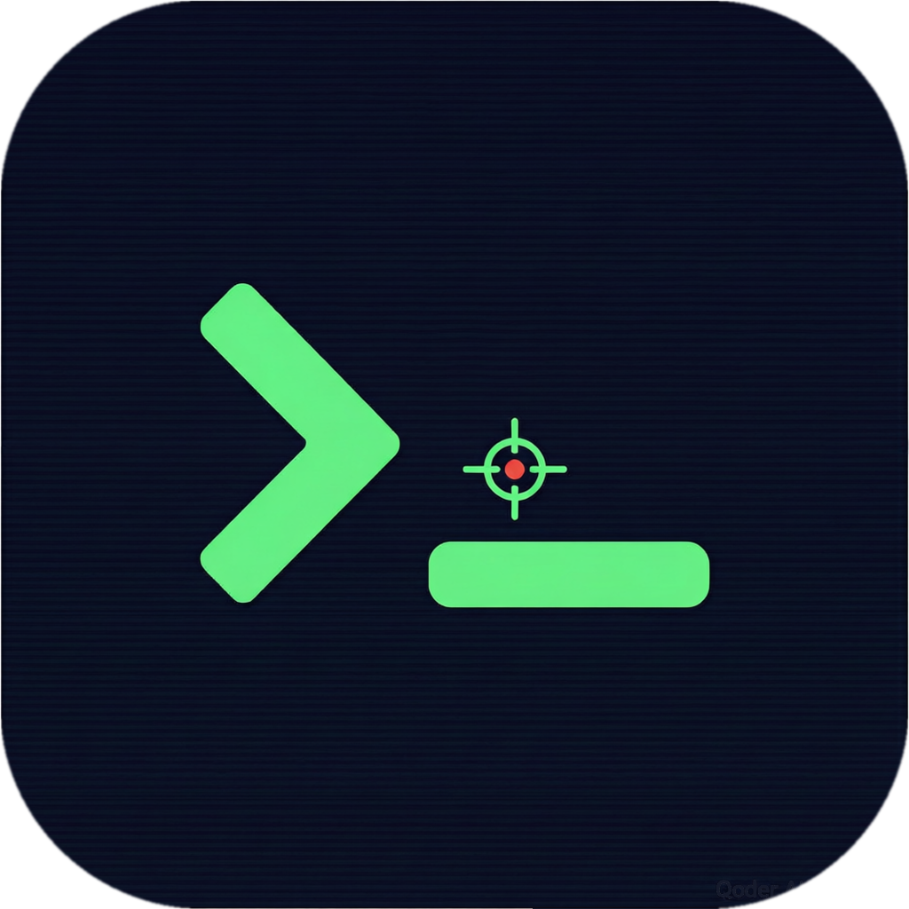
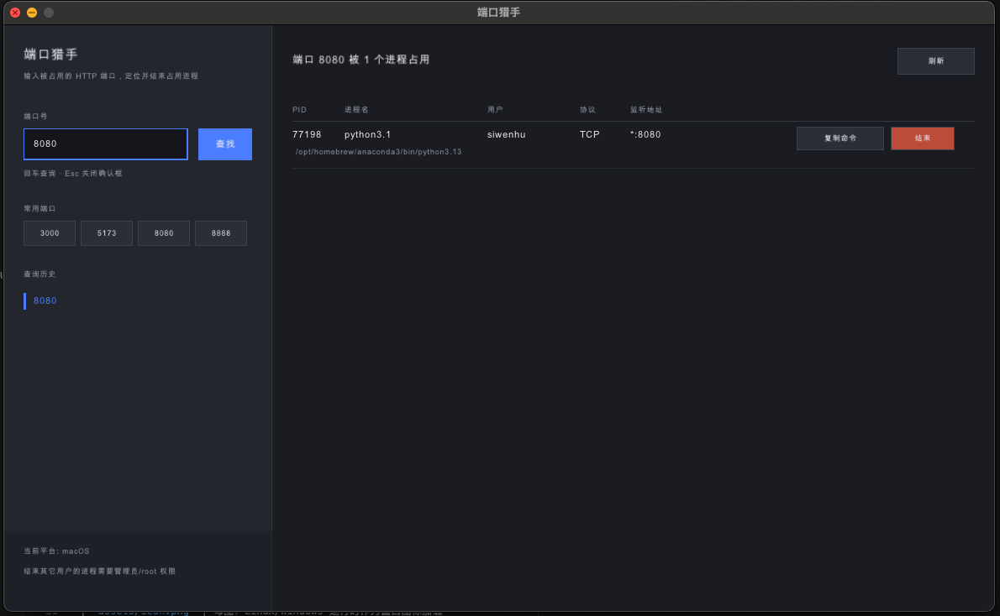

# 端口猎手 PortHunter

跨平台桌面小工具：输入被占用的 HTTP 端口（例如 8080），列出占用该端口的进程，给出可直接复制执行的杀进程命令；也可以在应用内二次确认后直接结束进程。

<br clear="all" />



> 左侧输入端口号（回车即查），右侧列出占用该端口的进程，可复制杀进程命令或直接结束。

界面为左右分栏：左侧输入端口、常用端口快捷入口、查询历史；右侧结果表格（PID / 进程名 / 用户 / 协议 / 监听地址 / 可执行路径）与操作按钮。

- UI：[raylib](https://www.raylib.com)（C++，立即模式绘制，无额外 UI 依赖）
- 平台：Windows / macOS / Linux 三端同一套代码，平台差异只在进程查询实现里
- 构建：CMake（本机已安装 raylib 则直接链接，否则 FetchContent 自动拉取 5.5）

## 各端实现方式

| 平台 | 查询占用进程 | 杀进程命令 |
| --- | --- | --- |
| Windows | IP Helper API：`GetExtendedTcpTable` / `GetExtendedUdpTable`（不起子进程） | `taskkill /PID <pid> /F` |
| macOS | `lsof -nP -iTCP:<port> -sTCP:LISTEN`，UDP 同理；路径用 `proc_pidpath` | `kill -9 <pid>` |
| Linux | `ss -Hlnt`/`-Hlnu` 解析 `users:(("name",pid=...,fd=...))`；无 ss 时退回 lsof | `kill -9 <pid>` |

查询在后台线程执行，界面不卡顿；结束后自动重查一次，列表即时反映结果。

## 图标

同一张母图（`assets/icon.png`，1024×1024，圆角 + 透明通道）导出三端各自需要的形式：

| 文件 | 用途 |
| --- | --- |
| `assets/icon.png` | 母图；Linux/Windows 运行时作为窗口图标加载（macOS 普通窗口无图标，跳过） |
| `assets/icon.ico` | 由 `packaging/port_hunter.rc` 编译进 exe，任务栏与资源管理器图标 |
| `packaging/port_hunter.icns` | 放进 .app 的 `Contents/Resources`，Dock 与访达图标 |
| `assets/icons/{256,512}x{256,512}/port_hunter.png` | 安装到 hicolor 图标主题，配合 `port_hunter.desktop` |

重新生成图标（改动母图后执行）：

```bash
magick assets/icon.png -define icon:auto-resize=256,128,64,48,32,16 assets/icon.ico
magick assets/icon.png -resize 256x256 assets/icons/256x256/port_hunter.png
magick assets/icon.png -resize 512x512 assets/icons/512x512/port_hunter.png
mkdir -p /tmp/hs.iconset && for s in 16 32 64 128 256 512; do magick assets/icon.png -resize ${s}x${s} /tmp/hs.iconset/icon_${s}x${s}.png; done
for s in 16 32 128 256 512; do magick assets/icon.png -resize $((s*2))x$((s*2)) /tmp/hs.iconset/icon_${s}x${s}@2x.png; done
iconutil -c icns /tmp/hs.iconset -o packaging/port_hunter.icns
```

## 构建

### macOS

```bash
brew install cmake raylib
cmake -S . -B build -DCMAKE_PREFIX_PATH=/opt/homebrew -DCMAKE_BUILD_TYPE=Release
cmake --build build
open build/bin/port_hunter.app        # 或 ./build/bin/port_hunter.app/Contents/MacOS/port_hunter 8080
```

### Linux

```bash
sudo apt install cmake libglfw3-dev libgl1-mesa-dev libxrandr-dev libxi-dev libxcursor-dev libxinerama-dev
cmake -S . -B build -DCMAKE_BUILD_TYPE=Release && cmake --build build
./build/bin/port_hunter
```

发行版若自带 raylib（`libraylib-dev`），CMake 会自动链接；否则首次配置会联网从 GitHub 拉取源码编译。

### Windows

需要 Visual Studio 2022（勾选「使用 C++ 的桌面开发」）与 CMake：

```bat
cmake -S . -B build
cmake --build build --config Release
build\Release\port_hunter.exe
```

raylib 未安装时同样走 FetchContent 自动编译。

命令行传入端口可跳过手动输入：`port_hunter 8080`。

## 权限说明

只能结束自己有权限的进程。结束其它用户或系统服务时：

- Windows：以管理员身份运行，否则 `taskkill` 返回拒绝访问
- macOS / Linux：以 root 运行（`sudo ./port_hunter`），否则 `kill -9` 失败

应用不会静默提权，失败时把原因显示在底部状态栏。

## 中文字体

界面为中文，启动时按平台加载系统字体（Windows `msyh.ttc`、macOS `PingFang.ttc`/`Arial Unicode.ttf`、Linux `NotoSansCJK`/`wqy-microhei`）。字形集合由 `src/ui_text.cpp` 的文案表自动推导，新增界面文字无需改字体代码。若系统没有中文字体，可在项目根目录放 `assets/fonts/ui.ttf`，左下角会提示加载失败并回退到 raylib 默认字体。

## 发布与三端打包

CI 在 `.github/workflows/release.yml`，推 `v*` tag 即自动出三端安装包并挂到 GitHub Release：

```bash
git tag v0.2.0
git push origin main --follow-tags
```

产物命名（`<ver>` 取自 tag，去掉前缀 v）：

| 平台 | runner | 产物 |
| --- | --- | --- |
| Windows x64 | windows-latest（MSVC） | `port_hunter-<ver>-windows-x64.zip` |
| Linux x64 | ubuntu-22.04 | `port_hunter-<ver>-linux-x64.deb` 与 `.tar.gz` |
| macOS arm64 | macos-14 | `port_hunter-<ver>-macos-arm64.dmg`（含 .app，可拖到 Applications） |

三端统一由 CMake 的 FetchContent 拉取 raylib 5.5 源码编译，不依赖 runner 上的 raylib 版本，避免 mac 与 win/linux 行为不一致。

注意事项：

- macOS 产物只做 ad-hoc 签名（`codesign -s -`），没有 Apple 公证，首次打开需右键 →「打开」绕过 Gatekeeper；分发给他人前若要消除提示，需要开发者证书 + `notarytool` 公证。
- 每个 runner 只产出本机架构：`macos-14` 是 arm64，需要 Intel 或通用二进制要另加 `macos-13` 任务或用 `lipo` 合并。
- 构建失败后不要给同一个 tag 重新打包（Release 附件会残留旧产物），直接递增版本号重新打 tag。
- 只想验证流水线而不发版：在 Actions 里手动运行 `workflow_dispatch`，输入版本号（默认 `0.0.0-ci`），只上传 artifact 不发 Release。

## 目录

```
CMakeLists.txt
.github/workflows/release.yml        三端打包 + 发 Release
assets/icon.png                      图标母图
assets/screenshot.png                README 顶部运行界面展示图
assets/icon.ico                      Windows exe 图标
assets/icons/                        Linux hicolor 图标
packaging/Info.plist.in              macOS .app 元信息
packaging/port_hunter.rc.in          把 .ico 编进 exe（Windows）
packaging/port_hunter.icns           macOS Dock/访达图标
packaging/port_hunter.desktop        Linux 启动器条目
src/main.cpp                         窗口、左右分栏布局、交互与确认弹窗
src/ui_widgets.{h,cpp}               按钮/文本绘制、文字裁剪、格式化
src/ui_text.{h,cpp}                  中文文案表 + 按文案生成字形集加载字体
src/port_scanner.h                   统一接口：ScanPort / TerminateProcess / PlatformName
src/port_scanner_win.cpp             Windows：IP Helper + taskkill
src/port_scanner_posix.cpp           macOS/Linux：lsof / ss + kill
```
